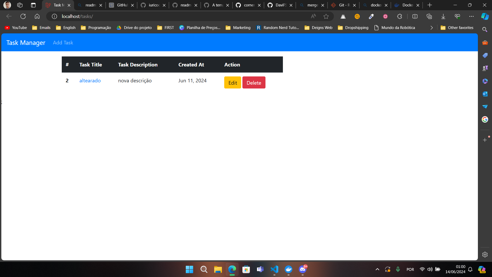
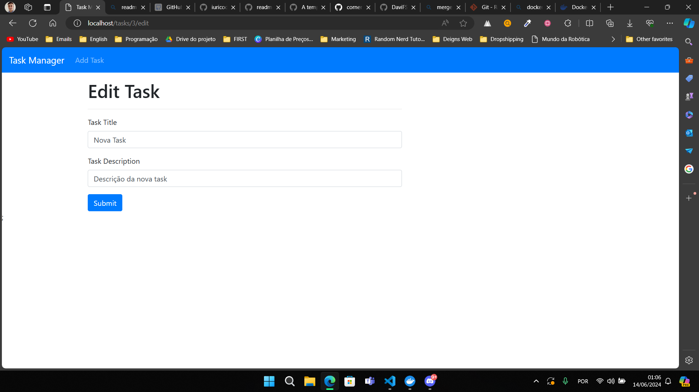

# VagaFull Challenge

Solving RT Medical Systems' VagaFull challenge. This challenge was successfully completed by Davi Feitosa. All the requirements for completing the project were met.

## Getting Started

The project is built on the Laravel PHP framework. It also uses Docker to build containers that run the code.

To test the project, simply clone the repository:

    git clone https://github.com/DaviFSilva/vagafull-davi.git

### Prerequisites

Before cloning the repository, make sure you have the following tools installed:
- [PHP](https://www.php.net/);
- [Composer](https://getcomposer.org/);
- [Docker](https://www.docker.com/).

### Installing

Once you have cloned the repository, go into the **docker** folder:

    cd vagafull-davi/docker

Start the docker containers:

    docker-compose up -d --build nginx mariadb

Still in the docker folder, migrate the "tables" from the code to the database running in docker

    // Entering the workspace bash to run the php commands  
    $ docker-compose exec workspace bash

    // Command to transfer the tables
    $ php artisan migrate

    // Exit workspace bash
    $ exit

After setup, to access the project in the browser, go to:

    http://localhost/tasks

### Project Images
#### Tasks Page

**After Edit:**

**After Delete:**

#### Add Task Page

#### Showing Task

#### Edit Task Page
