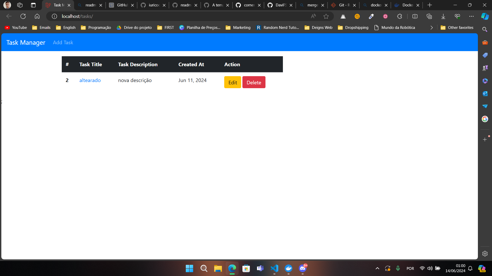
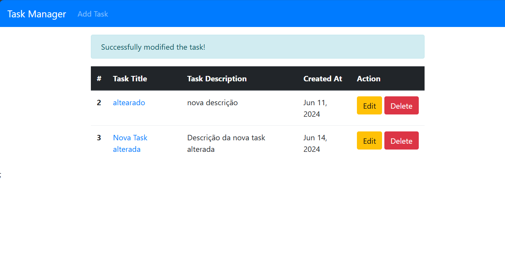
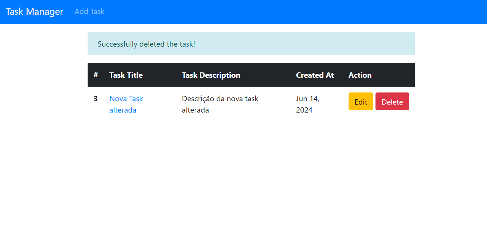
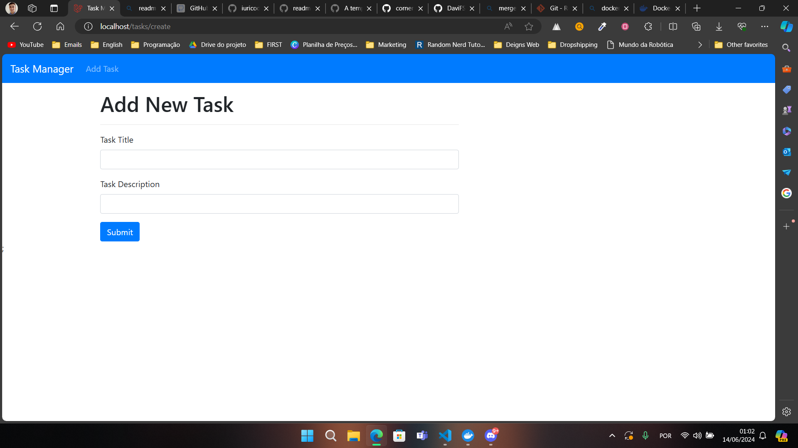
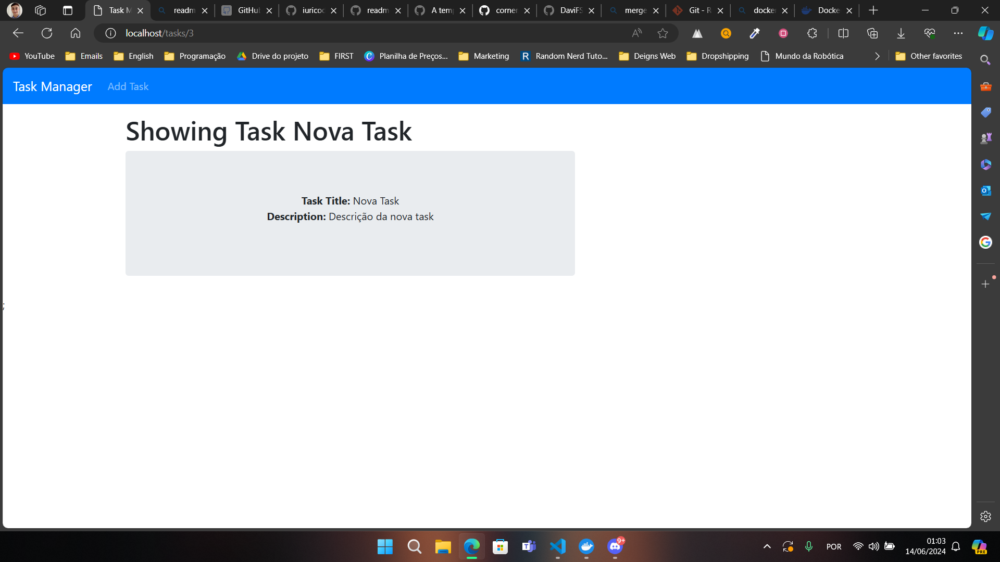

# Desafio VagaFull

Resolução do desafio VagaFull da RT Medical Systems. Esse desafio foi finalizado com sucesso por Davi Feitosa. Todos os requisitos para a conclusão do projeto foram alcançados.

## Getting Started

O projeto é construído a partir do framework PHP Laravel. Também se utiliza do Docker para construção de contêineres que rodaram o código.

Para testar o projeto, basta clonar o repositório:

    git clone https://github.com/DaviFSilva/vagafull-davi.git

### Prerequisites

Antes de clonar o repositório, certifique-se de ter as seguintes ferramentas instaladas:
- [PHP](https://www.php.net/);
- [Composer](https://getcomposer.org/);
- [Docker](https://www.docker.com/).

### Installing

Após ter clonado o repositório, entre na pasta **docker**:

    cd vagafull-davi/docker

Inicie os contêineres docker:

    docker-compose up -d --build nginx mariadb

Ainda na pasta docker, migre as "tables" do código para a database rodando no docker

    // Entrando no bash do workspace para rodar os comandos php  
    $ docker-compose exec workspace bash

    // Comando para transferir as tables
    $ php artisan migrate

    // Sai do bash do workspace
    $ exit

Depois do setup, para acessar o projeto no navegador, acesse:

    http://localhost/tasks

### Project Images
#### Tasks Page

**After Edit:**

**After Delete:**

#### Add Task Page

#### Showing Task

#### Edit Task Page

